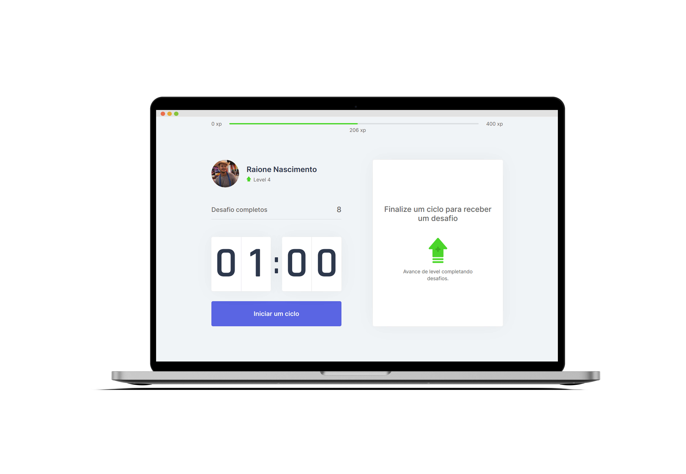

##  Move iT

<div align="center">
	
</div>

<br>

<div align="center">

  <!-- HTML -->
  <a href="https://www.w3schools.com/tags/tag_doctype.asp" target="_blank">
    
  </a>

  <!-- CSS -->
  <a href="https://devdocs.io/css/" target="_blank">
    
  </a>

  <!-- TypeScript -->
  <a href="https://www.typescriptlang.org/#" target="_blank">
    
  </a>

  <!-- Next.js -->
  <a href="https://www.sqlite.org/docs.html" target="_blank">
    
  </a>

  <!-- ReactJS -->
  <a href="https://nodejs.org/en/" target="_blank">
    
  </a>

  <!-- RocketSeat -->
  <a href="https://rocketseat.com.br" target="_blank">
    
  </a>

</div>

<h3 align=center>

Move-it é uma aplicação desenvolvida na semana da **Next Level Week #4**  da **[Rocketseat](https://www.rocketseat.com.br)** utilizando as tecnologias **HTML, CSS, TypeScript, Next.js e React.js**

</h3>

<h1 align=center>
  
</h1>


## 🚀 Objetivo 

<p align=justify> 
  Move iT é uma aplicação com exercícios essenciais para quem passa várias horas do dia sentado no computador, auxiliando a manter o metabolismo em dia. Se você é uma dessas pessoas, precisa conhecer o <b>Move iT<b>. 


  Completando os desafios, você ganha experiência para atingir os mais altos níveis.
</p>

Acesse a aplicação aqui [Move iT](https://move-it-flame-ten.vercel.app/)

#### 📑 **Web** - ***HTML, CSS, TypeScript, Next.js e React.js***

  - **[HTML](https://www.w3schools.com/html/html_intro.asp)**
  - **[CSS3](https://www.w3.org/Style/CSS/Overview.en.html)**
  - **[TypeScript](https://www.typescriptlang.org/#)**
  - **[Next.js](https://nextjs.org/)**
  - **[React.js](https://pt-br.reactjs.org/)**


#### 👨🏽‍💻  **Utilitários**
  - Deploy: **[Vercel](https://vercel.com/)**
  - Protótipo: **[Protótipo (Move iT)](https://www.figma.com/file/dS4bOPEtfpOMWLHTwaXnv7/Move.it-1.0-(Copy)?node-id=149898%3A199)**
  - Editor: **[Visual Studio Code](https://code.visualstudio.com/download)** 
  - Imsomnia: **[Imsomnia](https://insomnia.rest/download/)**
  - Fontes: **[Inter](https://fonts.google.com/specimen/Inter?preview.text_type=custom)** | **[Rajdhani](https://fonts.google.com/specimen/Rajdhani?preview.text_type=custom)**

### *** Configurações Iniciais ***

Primeiro, você precisa ter o [Node.js](https://nodejs.org/en/download/) e o [Git](https://git-scm.com/) instalados na sua máquina. 

Se você estiver utilizando o **Linux** ou **MacOS**, você pode optar por instalar o **Node** através do gerênciador de versões através do [link](https://nodejs.org/en/download/package-manager/) para facilitar o processo de mudança da versão do **Node**, quando for necessário.

Você pode optar também por utilizar o **yarn** no lugar do **npm**. Você pode instalar clicando nesse [yarn](https://yarnpkg.com/), ou através do [link](https://classic.yarnpkg.com/pt-BR/docs/install/#debian-stable).


### *** Clonando aplicação ***

```sh
# Faça o clone dos arquivos:
$ git clone https://github.com/RaioneNascimento/move-it.git

# Acesse a pasta da aplicação:
$ cd move-it
```

### *** Instalação das dependências ***

Aqui iremos instalar as dependências contidas nos arquivos `package.json`, que podemos encontrar na raíz do repositório. Para instalar as dependências, basta abrir o terminal dentro de **move-it** e digitar os comandos:

```sh
# Instalar todas as dependências:
$ yarn install ou npm i

# Rodar aplicação:
$ yarn dev
```
Após o procedimento, abra o navegador através do link ``http://localhost:3000``. 


## 🙏 Considerações finais

Fica aqui o agradecimento ao Diego Fernandes e Mayk Brito por sempre ensinar alcançar o próximo nível e nos mostrar que ***o aprendizado é contínuo e sempre haverá um próximo nível***.

<div align="center">

  <table style="width:100%">
    <tr align="center">
      <th><strong>Rocketseat</strong></th>
      <th><strong>diego3g</strong></th>
      <th><strong>maykbrito</strong></th>
    </tr>
    <tr align="center">
      <td>
        <a href="https://rocketseat.com.br/">
          
        </a>
      </td>
      <td>
        <a href="https://github.com/diego3g">
          
        </a>
      </td>
      <td>
        <a href="https://github.com/maykbrito">
          
        </a>
      </td>
    </tr>
  </table>

</div>

<p align=center>
  <strong>Instrutores:</strong>
  <a href="https://github.com/diego3g" target="_blank">Diego Fernandes |</a>
  <a href="https://github.com/maykbrito" target="_blank">Mayk Brito</a>
</p>

<p align=center>
  Gostou do projeto? Me ajude deixando uma estrela 🤓
</p>
`made with 💜 by raionedeveloper © 2020`
